# VaidyaVani — Final Strategy v3 (Merged & Evolved)

> **Last Updated**: May 30, 2026
> **Status**: Ready for execution — 5 open decisions pending

## What Changed from v2 → v3

| Enhancement | Source | Impact |
|---|---|---|
| **Concrete dentist scenario** with real doctor examples | External plan | Makes the entire strategy executable, not abstract |
| **Multi-city deduplication** — Expert Consensus model | External plan | Solves the "same question, 3 cities" content collision |
| **Dynamic geo-IP routing** on pillar pages | External plan | Personalizes central domain for local conversion |
| **Specialty Pillar Pages** (`/specialties/dentistry/`) | External plan | New URL layer for mid-funnel traffic capture |
| **Audio exclusivity rule** — only doctor sites host full audio | External plan | Stronger content differentiation between domains |
| **Moat 3: Ailment-to-Language Database** | External plan | Proprietary keyword asset from regional search patterns |
| **GBP reviews live sync** on doctor homepage | External plan | Stronger social proof + trust signal |
| **Visual UI mockups** for every URL route | New in v3 | Tangible design direction for development |

---

## The Core Insight

AI answer engines (ChatGPT, Gemini, Perplexity, Grok, Meta AI) are becoming the **new front door to healthcare information**. When a patient in Lucknow asks WhatsApp Meta AI *"best treatment for piles without surgery?"*, the AI pulls from indexed web content. The doctor who has that answer — in Hindi, in their voice, with credentials attached — wins the patient.

**Voice blogs solve the doctor's #1 constraint: time.** A 90-second voice answer to a curated question becomes a multilingual SEO asset that compounds forever.

---

## The Real-World Scenario

To make everything concrete, we use **Dentists in India** (Orthodontics/Braces + Implants) across Mumbai, Bangalore, and Delhi:

| Doctor | City | Languages |
|--------|------|-----------|
| **Dr. Amit Shah** (Orthodontist) | Bandra, Mumbai | English + Hindi + Marathi |
| **Dr. Priya Nair** (Pediatric Dentist) | Indiranagar, Bangalore | English + Hindi + Kannada |
| **Dr. Rohan Verma** (Orthodontist) | GK-2, Delhi | English + Hindi |

**Weekly Voice Query:** *"When is the right age for a child to get braces, and do they hurt?"*

---

## Product Architecture

### The Doctor Experience (2 min/week)

```
Weekly Push (WhatsApp Bot)
    → "Dr. Sharma, this week's questions:"
    → Q1: "What causes recurring acidity after meals?"
    → Q2: "When should someone see a gastro vs. self-medicate?"
    → Q3: "Is endoscopy painful? What to expect?"
    
Doctor taps → Records 60-90 sec voice answer → Done.
```

### The Content Pipeline (Fully Automated)

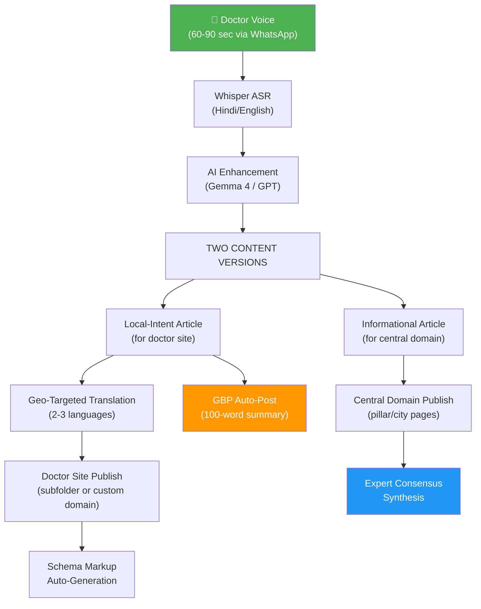

### What Gets Published (Per Voice Answer)

| Asset | Where | Purpose |
|-------|-------|---------|
| Voice Blog (audio + local-intent article) | Doctor site | Trust, E-E-A-T, local patient capture |
| Informational article (expert-reviewed framing) | Central domain | Topical authority, informational intent |
| Multilingual versions (2-4 geo-targeted langs) | Doctor site | Regional search capture |
| GBP Update post (100-word summary + CTA) | Google Business Profile | **Immediate local visibility (Week 1 ROI)** |
| FAQ schema entry | Both (different questions) | Rich snippet / AI citation |
| Short-form audio clip | WhatsApp/Social | Distribution & backlinks |

---

## Master URL Routing Map

### 1. Central Domain (`vaidyavani.com`)

| Route | URL | Purpose |
|-------|-----|---------|
| **Homepage** | `vaidyavani.com/` | Search routing, trending queries, directory |
| **Specialty Pillar** | `vaidyavani.com/specialties/dentistry/` | Mid-funnel specialty overview |
| **Condition Pillar** | `vaidyavani.com/conditions/dental-braces-children/` | Informational intent, expert consensus |
| **City-Condition** | `vaidyavani.com/conditions/dental-braces-children/bangalore/` | Local informational intent |
| **Doctor Profile Hub** | `vaidyavani.com/dr/priya-nair/` | Starter tier doctor homepage |

### 2. Doctor Site — Starter Tier (Subfolder)

| Route | URL |
|-------|-----|
| **Homepage** | `vaidyavani.com/dr/priya-nair/` |
| **Voice Blog (English)** | `vaidyavani.com/dr/priya-nair/voice-blogs/child-braces-treatment-indiranagar/` |
| **Voice Blog (Kannada)** | `vaidyavani.com/dr/priya-nair/kn/voice-blogs/child-braces-treatment-indiranagar/` |
| **Ask Page** | `vaidyavani.com/dr/priya-nair/ask/` |

### 3. Doctor Site — Growth Tier (Custom Domain via Reverse Proxy)

| Route | URL |
|-------|-----|
| **Homepage** | `drshahdental.com/` |
| **Voice Blog (English)** | `drshahdental.com/voice-blogs/child-braces-treatment-bandra/` |
| **Voice Blog (Hindi)** | `drshahdental.com/hi/voice-blogs/child-braces-treatment-bandra/` |
| **Voice Blog (Marathi)** | `drshahdental.com/mr/voice-blogs/child-braces-treatment-bandra/` |
| **Ask Page** | `drshahdental.com/ask/` |

---

## Visual UI Previews

### Route 1: Central Homepage — `vaidyavani.com/`

**Purpose**: Search intent routing, directory discovery, trending health queries

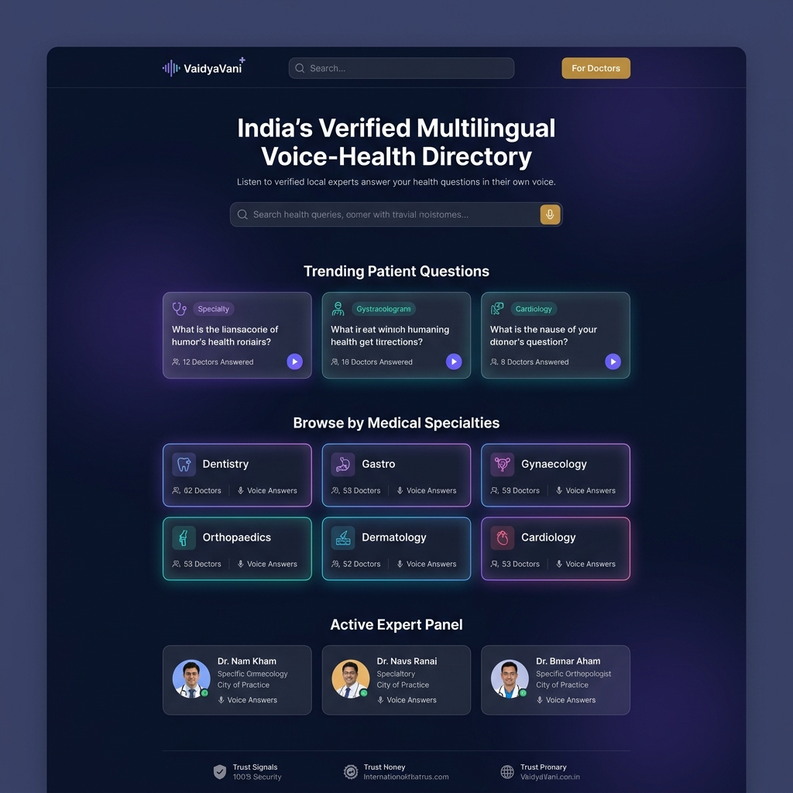

**Key SEO/AEO elements on this page:**
- Symptom/specialist search bar → routes to condition pages
- Trending questions (sourced from Reddit, PAA, patient queries) → internal links to pillar pages
- Specialty cards with doctor/answer counts → E-E-A-T trust signals
- Active Expert Panel → named, credentialed doctors visible on homepage
- Schema: `WebSite` + `SearchAction` + `ItemList` (specialties) + `Organization`

---

### Route 2: Condition Pillar Page — `vaidyavani.com/conditions/dental-braces-children/`

**Purpose**: Informational intent, expert consensus, national-level authority page with dynamic geo-routing

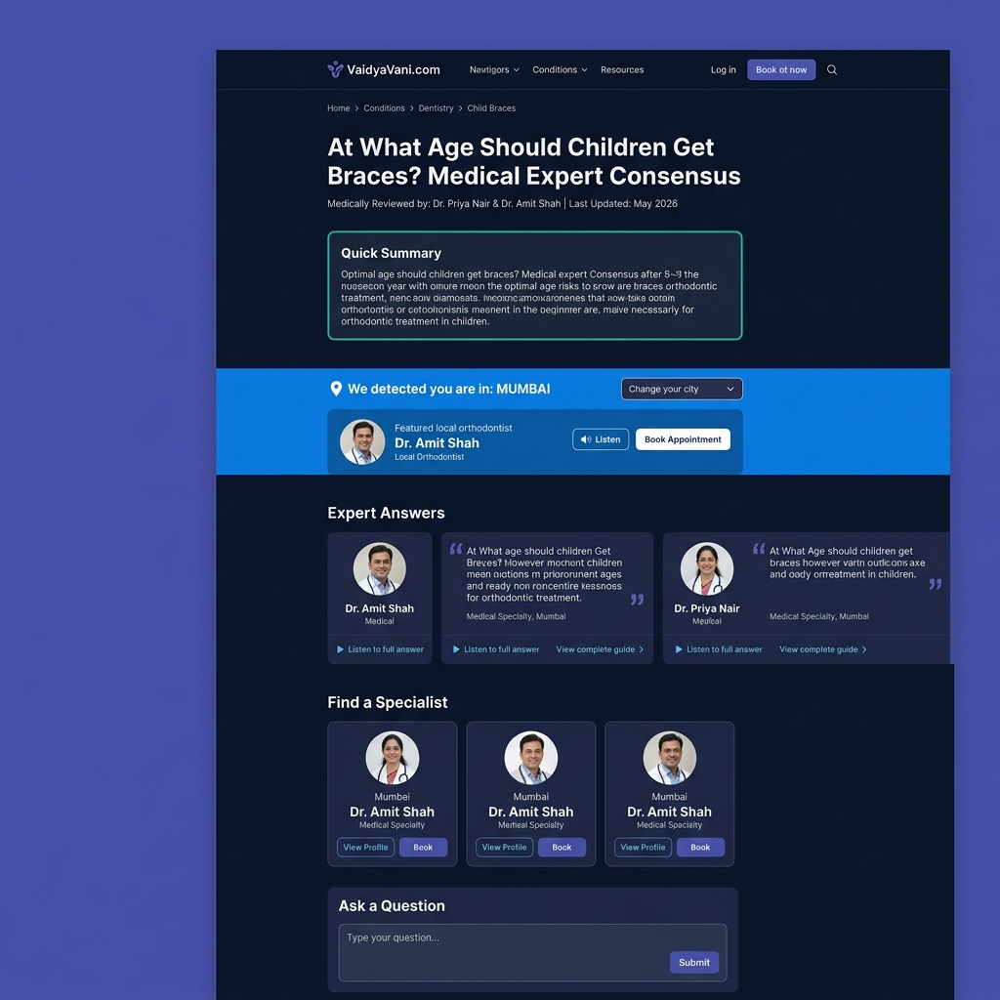

**How multi-city deduplication works on this page:**

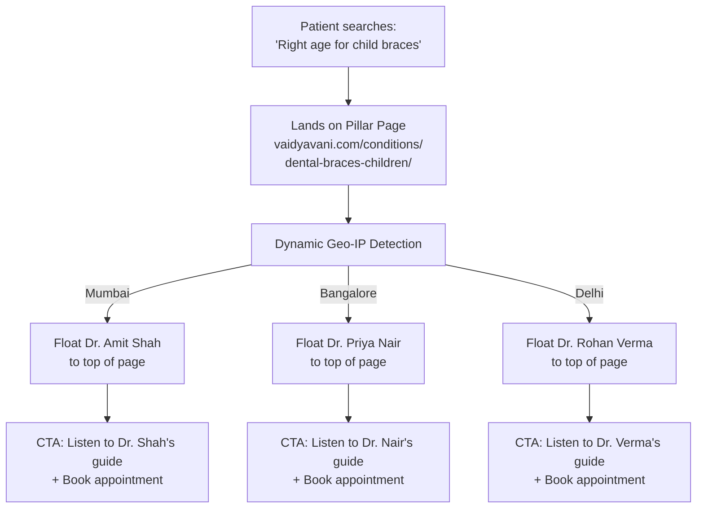

> **CRITICAL**: The AI engine synthesizes all three doctors' voice notes into ONE comprehensive master guide on this page — a "Consensus Guide" rather than any single doctor's blog. Title pattern: *"At What Age Should Kids Get Braces? We Asked 3 Top Orthodontists."*

**Key SEO/AEO elements:**
- Quick Summary box → position zero / featured snippet target
- Geo-locator banner → personalizes CTA by city, improves conversion
- Expert quote blocks with attribution → AI citation-ready format
- Each quote links to doctor's local-intent page → contextual backlinks
- "Ask a Question" form at bottom → feeds query intelligence pipeline
- Schema: `MedicalWebPage` + `FAQPage` + `Physician` (multiple) + `BreadcrumbList`

---

### Route 3: City-Condition Page — `vaidyavani.com/conditions/dental-braces-children/bangalore/`

**Purpose**: Hyper-local informational intent (e.g., "child braces dentist Bangalore"), features local doctor exclusively

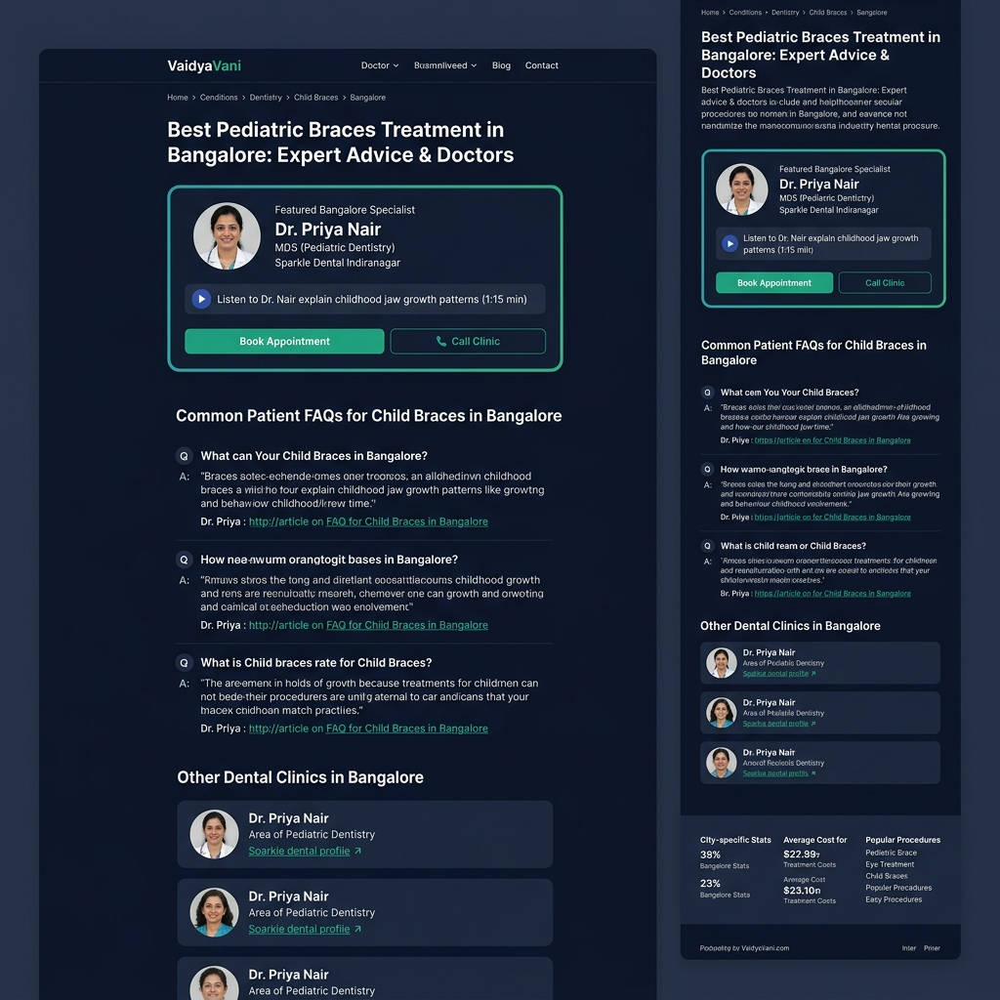

**Content differentiation from the Pillar Page:**

| Element | Pillar Page (National) | City Page (Bangalore) |
|---------|----------------------|----------------------|
| Featured doctor(s) | All 3 doctors equally (geo-personalized) | Dr. Priya exclusively at top |
| FAQs | General medical questions | City-specific: costs, clinics, procedures in Bangalore |
| Doctor listing | National directory | Only Bangalore-area dentists |
| Audio | No full audio (links to doctor sites) | Dr. Priya's audio excerpt (short clip) |
| Schema | `MedicalWebPage` + multi-`Physician` | `MedicalWebPage` + `ItemList` + `LocalBusiness` signals |

**Key SEO elements:**
- H1 targets: "Best Pediatric Braces Treatment in Bangalore"
- City-specific pricing data → captures "braces cost Bangalore" queries
- Featured specialist card with "Book" + "Call" CTAs → direct conversion
- "Other Dental Clinics in Bangalore" → internal linking to more profiles

---

### Route 4: Doctor Homepage — `drshahdental.com/`

**Purpose**: Doctor's brand site (Growth Tier, custom domain). Transactional funnel → booking.

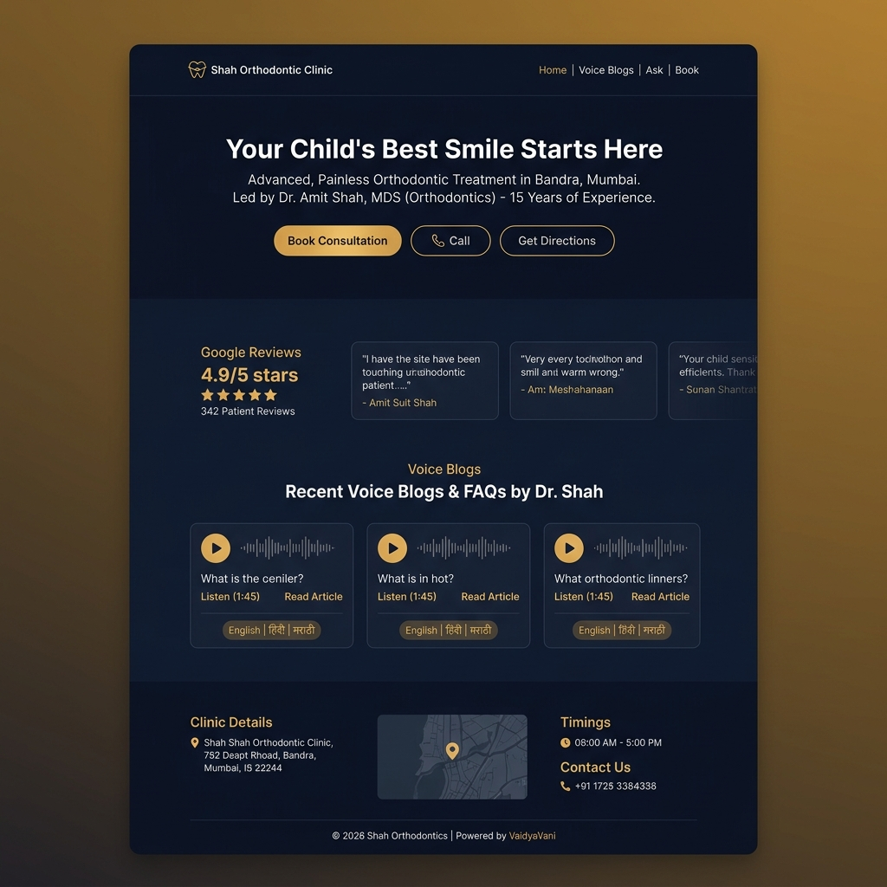

**Key design decisions:**
- **Gold/amber accent** differentiates the doctor site from the teal central domain → distinct brand identity
- **GBP Reviews live sync** at top → instant social proof before scrolling
- **Voice Blog cards with waveform visualization** → audio-first identity, unique to the platform
- **Language badges** on each blog card → signals multilingual content
- **"Powered by VaidyaVani"** in footer → backlink + platform attribution
- Schema: `LocalBusiness` + `Physician` + `WebSite` + `Review` (aggregate)

---

### Route 5: Doctor Voice Blog (English) — `drshahdental.com/voice-blogs/child-braces-treatment-bandra/`

**Purpose**: The primary content page. Local-intent, transactional. Audio is ONLY hosted here (not on central domain).

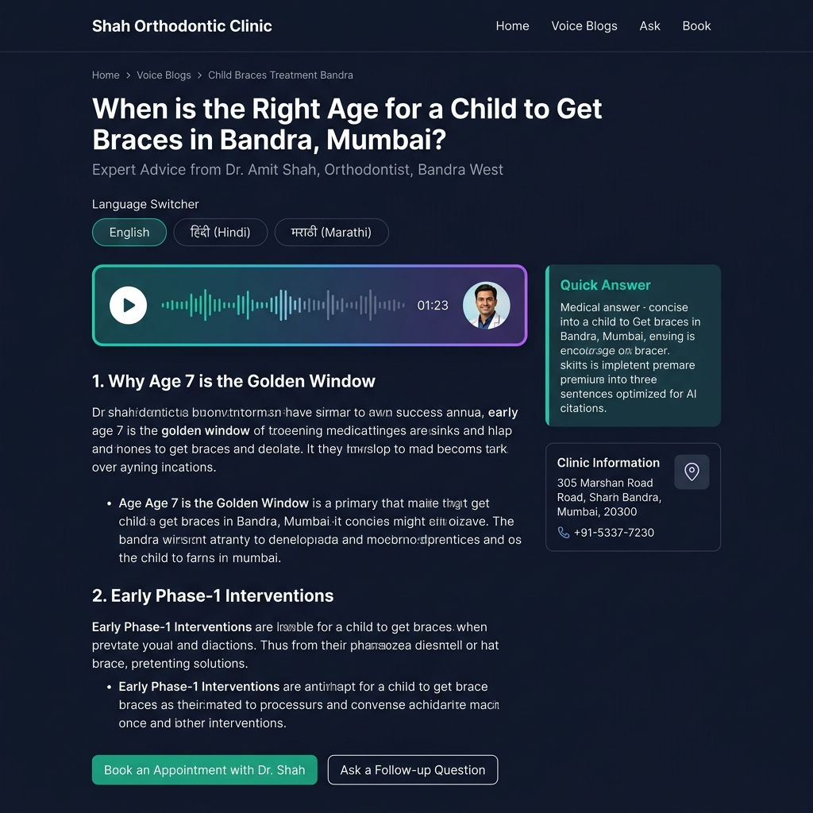

**Page structure for maximum AI citability:**

```
┌─────────────────────────────────────────────────┐
│  H1: Local-intent title with city + doctor name │
│  Subtitle: Doctor credentials + specialty       │
├─────────────────────────────────────────────────┤
│  Language Switcher: [English] [हिंदी] [मराठी]   │
├─────────────────────────────────────────────────┤
│  🎤 AUDIO PLAYER (unique to doctor site)        │
│  Waveform + play button + doctor avatar         │
├─────────────────────────────────────────────────┤
│  📝 QUICK ANSWER BOX (AI citation target)       │
│  2-3 sentence direct medical answer             │
│  ← This is what AI engines cite                 │
├─────────────────────────────────────────────────┤
│  DETAILED TRANSCRIPT (structured with H2/H3)    │
│  1. Why Age 7 is the Golden Window              │
│  2. Early Phase-1 Interventions                 │
│  3. What to Expect at Our Bandra Clinic         │
├──────────────────────┬──────────────────────────┤
│  Main content        │  SIDEBAR:               │
│  (continues)         │  - Quick Answer box     │
│                      │  - Clinic Info card     │
│                      │  - Map + phone          │
├──────────────────────┴──────────────────────────┤
│  CTAs: [Book Appointment] [Ask Follow-up]       │
└─────────────────────────────────────────────────┘
```

> **Audio exclusivity rule**: Only the doctor's site hosts the full raw audio file. The central domain can embed short clips or transcription-only excerpts, but the original voice recording is exclusive to the doctor's domain. This creates a unique media asset that differentiates the doctor site from the central domain in Google's eyes.

**Schema stack**: `MedicalWebPage` + `Physician` + `AudioObject` + `LocalBusiness` + `FAQPage` + `BreadcrumbList`

---

### Route 6: Doctor Voice Blog (Regional Language) — `drshahdental.com/mr/voice-blogs/child-braces-treatment-bandra/`

**Purpose**: Regional language long-tail targeting. Captures transliterated and Devanagari-script searches.

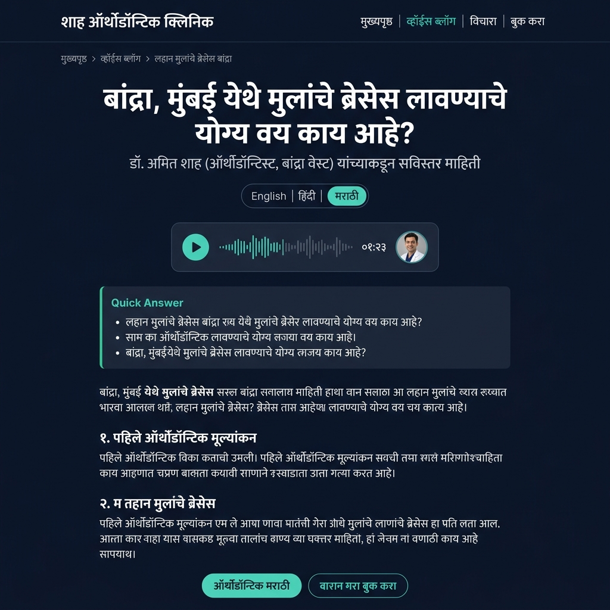

**What makes the regional page work:**
- **Entire UI in Marathi** — nav, breadcrumbs, headings, CTAs, everything
- **Marathi numerals** on the audio player (०१:२३)
- **Language switcher** with Marathi highlighted as active
- **Medical terminology in Marathi** — not just translation, but localized medical vocabulary
- **Captures searches like**: "बांद्रा मध्ये मुलांचे ब्रेसेस किंमत", "ऑर्थोडॉन्टिस्ट बांद्रा"
- **hreflang**: `<link rel="alternate" hreflang="mr" href="/mr/voice-blogs/..." />`

---

### Route 7: Patient "Ask" Page — `drshahdental.com/ask/`

**Purpose**: Organic question ingestion. Completes the content flywheel.

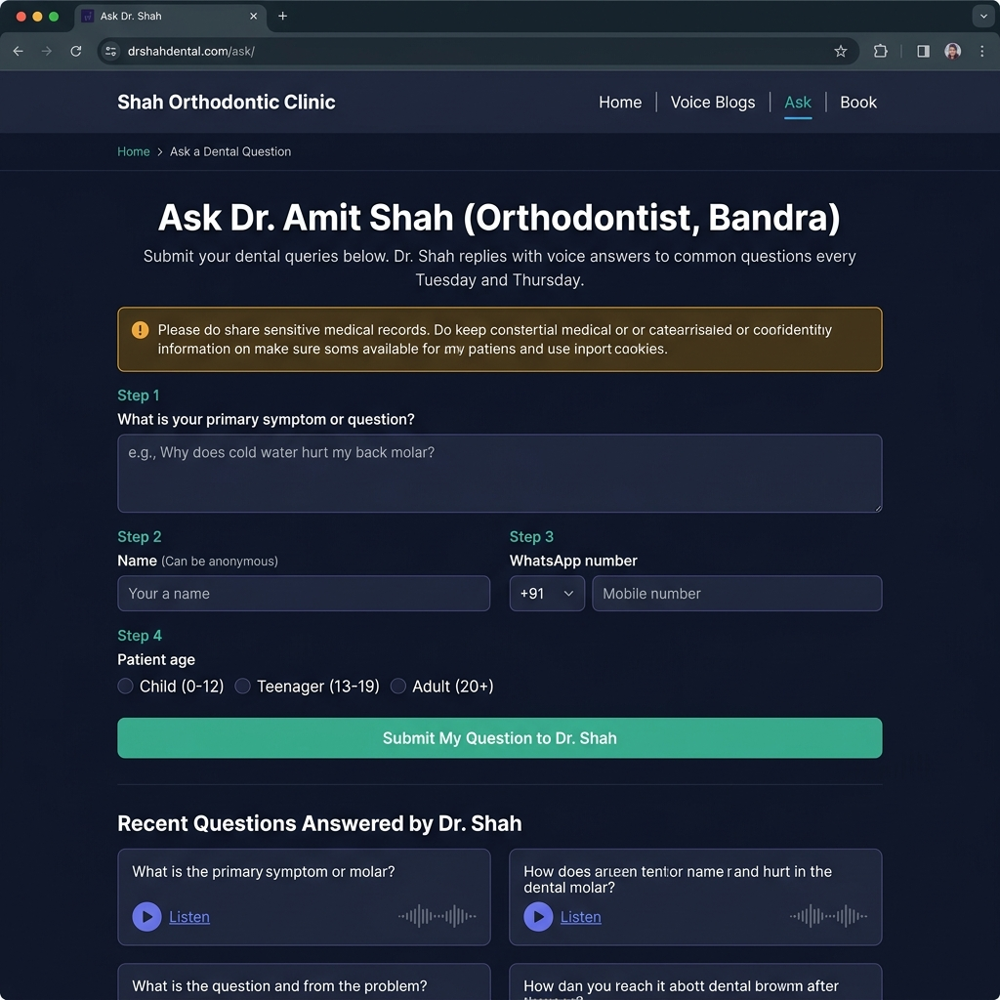

**How the Ask page feeds the flywheel:**

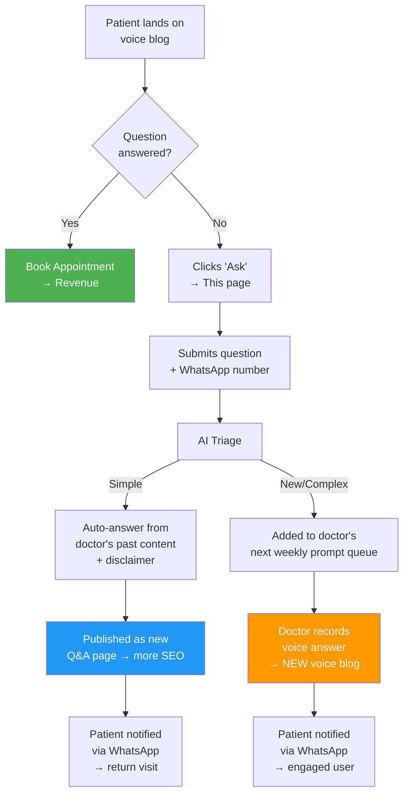

**Key design decisions:**
- **Step-by-step form** reduces cognitive load (not a wall of fields)
- **WhatsApp number collection** → closes the loop when answer is published
- **"Recent Questions Answered"** section → proves the system works, encourages submission
- **Patient age selector** → contextualizes the question for the doctor
- **"Can be anonymous"** on name → reduces friction
- Schema: `WebPage` + `AskAction`

---

## Domain & Content Architecture

### The Dual-Intent Split (Critical Architecture Decision)

The central domain and doctor sites publish **original content targeting different search intents**, each with self-referential canonical tags. **No cross-domain canonicals ever.**

| Dimension | Central Domain | Doctor Site |
|-----------|---------------|-------------|
| **Search intent** | Informational ("what", "why", "when") | Local/transactional ("who near me", "how to book") |
| **Title pattern** | "At What Age Should Kids Get Braces? We Asked 3 Orthodontists" | "How Dr. Shah Treats Child Braces in Bandra, Mumbai" |
| **Content tone** | Scholarly, multi-expert, consensus | Personal, clinic-focused, reassuring |
| **Audio** | ❌ No full audio (links to doctor sites) | ✅ Full original recording (exclusive) |
| **Canonical** | Self-referential (`rel="canonical" href="self"`) | Self-referential (`rel="canonical" href="self"`) |
| **E-E-A-T signal** | Multiple verified medical reviewers | Single doctor + credentials + experience |
| **CTA** | "Find a specialist near you" → links to doctors | "Book appointment with Dr. X" → direct booking |

> ⚠️ **NEVER use cross-domain canonicals.** The central domain's canonical must always point to itself. The doctor's canonical must always point to itself. Cross-domain canonicals would de-index the central domain.

### Hosting Architecture: Subfolder-First

- **Starter Tier**: Doctor sites live at `vaidyavani.com/dr/doctor-name/` → inherits central domain's DA immediately
- **Growth Tier**: Custom domain mapped via reverse proxy → `drshahdental.com/` serves content from platform backend
- **Migration path**: 301 redirects from subfolder → custom domain, Google transfers ranking signals in 2-4 weeks

---

## Handling Multiple Cities for the Same Question

> **This is the most nuanced SEO challenge in the entire system.** When 3 doctors in 3 cities answer the same question, you CANNOT publish 3 generic pages on the central domain. Google would flag them as duplicates.

### The Expert Consensus + Dynamic Geo-Routing Model

1. **All 3 doctors** record their voice notes answering the same weekly question
2. **Central Pillar Page** (`/conditions/dental-braces-children/`) → AI synthesizes into ONE master consensus guide citing all 3 doctors. Dynamic geo-IP floats the nearest doctor to the top.
3. **City Sub-Pages** (`/conditions/.../bangalore/`) → Automatically generated with the LOCAL doctor featured exclusively at the top. Different H1, different FAQs (city-specific pricing/logistics), different CTA.
4. **Doctor Local Pages** (3 separate pages, one per doctor) → Each doctor's site gets their own unique local-intent article framed around their specific clinic and city.

**Result**: 1 question → 1 consensus pillar + 3 city sub-pages + 3 unique doctor pages = **7 non-competing pages** capturing informational, local-informational, and transactional intent across 3 cities.

---

## GBP Integration (Day 1 Feature)

### Why This Is Non-Negotiable for Early ROI

Without GBP, doctors see zero results for 4-6 months while SEO compounds → high churn risk.
With GBP auto-posting, doctors see calls/directions within **14 days** → bridges the gap to organic SEO.

### Auto-Post Pipeline

Every voice blog triggers:
1. AI generates 100-word summary of the voice answer
2. GBP API publishes as a Google "Update" post on the doctor's profile
3. Post includes: summary, "Read full article →" link, doctor photo, CTA
4. GBP algorithm rewards weekly-active profiles → higher Map Pack ranking

### Doctor Dashboard Metrics (GBP)

| Metric | Week 1 | Month 1 | Month 3 |
|--------|--------|---------|---------|
| GBP profile views | 50-200 | 400-800 | 1,000+ |
| Website clicks from GBP | 5-10 | 20-50 | 80+ |
| Phone calls from GBP | 1-3 | 5-15 | 20+ |
| Direction requests | 2-5 | 10-30 | 50+ |

---

## Building the Compounding Moat

### 4 Self-Reinforcing Loops

#### Moat 1: Expert Consensus E-E-A-T Flywheel
- 1 doctor's blog = one opinion
- Central domain page synthesizing **50 verified dentists across 10 cities** = medical consensus
- More doctors → more "peer-reviewed" pillar pages → impossible for a new competitor with 5 doctors to match

#### Moat 2: Local Inter-Linking Topology
Every new doctor creates bidirectional contextual links:
```
Central Pillar ←→ City Page ←→ Doctor Site
     ↑                              ↓
     └──────── backlinks ───────────┘
```
This rising tide lifts all doctors' rankings, making it impossible for an independent doctor's site to outrank the network.

#### Moat 3: Proprietary Ailment-to-Language Database
- Patient "Ask" submissions reveal **real regional search phrases** (e.g., Marathi-transliterated English patterns for "root canal pain" that Ahrefs/SEMrush completely miss)
- These proprietary queries feed back as doctor voice prompts → content that matches actual search behavior
- **This data asset is impossible to scrape or replicate**

#### Moat 4: Verified Voice Lock-In
After 2-3 years, a doctor has:
- 200+ personal audio answers
- Highly ranked localized pages
- Position on high-traffic pillar pages
- Geo-routing leads flowing daily

Churning means turning off a predictable, compounding patient stream. The switching cost isn't software — it's patients.

---

## Churn Protection (Dual-Content Advantage)

| Scenario | What Happens |
|----------|-------------|
| Doctor churns, domain expires | Central domain articles are independent, self-canonical → **zero traffic loss**. Simply swap "reviewed by" to active doctor. |
| Doctor churns, takes domain | Their audio and local articles go with them. Central domain keeps its own informational articles. Backlinks go stale (minor DA dip), content stays. |
| Doctor returns after 6 months | Re-activate their slot on pillar pages. GBP posting resumes. Existing content + authority picks up where it left off. |

### Terms of Service

1. **Doctor owns**: Voice recordings (portable), local-intent articles (can migrate)
2. **Platform owns**: Informational articles on central domain (written by platform AI, doctor credited as medical reviewer)
3. **On churn**: "Reviewed by Dr. X" → "Reviewed by Dr. Y" on central domain. Doctor's name optionally remains in article history as past contributor.

---

## Multilingual Strategy (Progressive Rollout)

### Geographic Language Mapping (Doctor Sites)

| Doctor Location | Languages |
|----------------|-----------|
| Maharashtra | English + Hindi + Marathi |
| Tamil Nadu | English + Hindi + Tamil |
| Karnataka | English + Hindi + Kannada |
| West Bengal | English + Hindi + Bengali |
| Kerala | English + Hindi + Malayalam |
| North India (UP, MP, Rajasthan) | English + Hindi only |
| Metro cities | English + Hindi + local state language |

### Rollout Phases

| Phase | When | Central Domain | Doctor Sites |
|-------|------|---------------|-------------|
| **1** | Month 1-3 | English + Hindi | English + Hindi + 1 regional |
| **2** | Month 4-6 (DA > 20) | + Tamil, Telugu, Bengali, Marathi | Same (data-driven adds only) |
| **3** | Month 7-12 (DA > 30) | + Kannada, Gujarati, Malayalam, Punjabi | + 1 more if multi-state patients |

---

## SEO & AEO Technical Details

### Schema Markup Stack

**Doctor sites:**
1. `MedicalWebPage` + `Physician` + `AudioObject` + `FAQPage` + `BreadcrumbList`
2. `LocalBusiness` (for the clinic)

**Central domain:**
1. `MedicalWebPage` + `MedicalScholarlyArticle` citations
2. `FAQPage` (different FAQs than doctor site — avoid overlap)
3. `ItemList` (for doctor directories)

### hreflang (Geo-Targeted, Not Blanket)

**Doctor site** (example: doctor in Pune):
```html
<link rel="alternate" hreflang="en" href="https://drsharma.com/voice-blogs/acidity/" />
<link rel="alternate" hreflang="hi" href="https://drsharma.com/hi/voice-blogs/acidity/" />
<link rel="alternate" hreflang="mr" href="https://drsharma.com/mr/voice-blogs/acidity/" />
<link rel="alternate" hreflang="x-default" href="https://drsharma.com/voice-blogs/acidity/" />
```
Only 3 hreflang tags. Not 10.

**Central domain** (Phase 2+, when authority is established):
```html
<link rel="alternate" hreflang="en" href="https://vaidyavani.com/conditions/acidity/" />
<link rel="alternate" hreflang="hi" href="https://vaidyavani.com/hi/conditions/acidity/" />
<link rel="alternate" hreflang="ta" href="https://vaidyavani.com/ta/conditions/acidity/" />
<link rel="alternate" hreflang="x-default" href="https://vaidyavani.com/conditions/acidity/" />
```

### Page Structure for AI Citability

```html
<article itemscope itemtype="https://schema.org/MedicalWebPage">
  <header>
    <div itemscope itemtype="https://schema.org/Physician">
      <h1>How Dr. Shah Treats Acid Reflux — Lucknow Gastroenterologist</h1>
      <p>By <span itemprop="name">Dr. Rajesh Sharma</span>, 
         <span itemprop="medicalSpecialty">Gastroenterologist</span>, 
         <span itemprop="address">Lucknow</span> 
         — <span itemprop="experience">15 years experience</span></p>
    </div>
  </header>

  <audio controls src="/voice-blogs/acidity-treatment.mp3"></audio>

  <section class="quick-answer" itemprop="mainContentOfPage">
    <h2>Dr. Sharma's Approach</h2>
    <p><strong>At my Lucknow clinic, I typically recommend...</strong></p>
  </section>

  <section>
    <h2>Detailed Explanation</h2>
    <!-- Local context: clinic address, availability, approach -->
  </section>

  <section class="cta">
    <a href="/book/">Book Appointment with Dr. Sharma</a>
    <a href="/ask/">Ask Dr. Sharma a Question</a>
  </section>

  <nav aria-label="Language">
    <a hreflang="hi" href="/hi/voice-blogs/acidity-treatment/">हिंदी</a>
    <a hreflang="mr" href="/mr/voice-blogs/acidity-treatment/">मराठी</a>
  </nav>
</article>
```

---

## Query Intelligence System

### Where Questions Come From

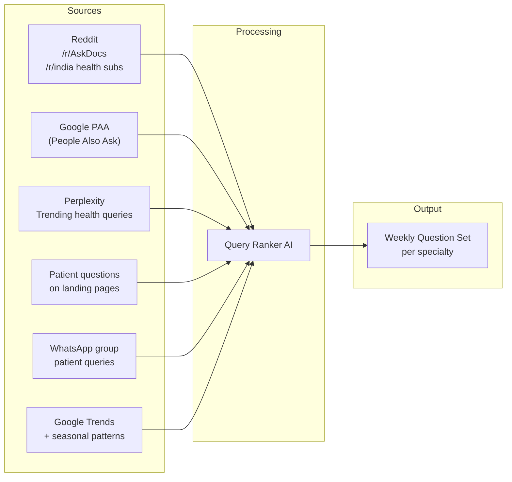

### Query Ranking Algorithm

| Factor | Weight | Source |
|--------|--------|--------|
| Search volume (exact + related) | 30% | Google Keyword Planner / SEMrush API |
| AI citation potential (asked on AI platforms?) | 25% | Reddit frequency + Perplexity trending |
| Content gap (no good voice/video answer exists) | 20% | SERP analysis |
| Monetization potential (leads to booking?) | 15% | Intent classification |
| Seasonal relevance | 10% | Google Trends |

### Smart Question Assignment

- **Doctor's specialty** (obvious)
- **Doctor's city** (for local-intent queries)
- **Doctor's past answers** (build topical depth, not breadth)
- **Competitive gaps** (if no doctor in network has covered X, prioritize)

---

## Business Model & Pricing

| Tier | Annual Price | Hosting | Languages | Key Features |
|------|-------------|---------|-----------|-------------|
| **Starter** | ₹30,000/yr | Subfolder (`vaidyavani.com/dr/name/`) | En + Hi + 1 regional | 2 Q/week, GBP auto-posting, central listing |
| **Growth** | ₹75,000/yr | Custom domain (reverse proxy) | En + Hi + 2 regional | 3 Q/week, Ask widget, booking integration, full schema |
| **Premium** | ₹1,50,000/yr | Custom domain + white-label | En + Hi + 3 regional | Everything + content strategist, social clips, analytics |

### Additional Revenue Streams

| Stream | Model | When |
|--------|-------|------|
| **Patient leads (pay-per-lead)** | ₹50-200 per qualified lead via "Ask" | Month 6+ |
| **Booking commission** | 5-10% on appointments booked | Month 6+ |
| **Pharma/diagnostic sponsorship** | Sponsored medical questions (disclosed) | Year 2 |
| **White-label for hospital chains** | Enterprise, ₹50K+/mo per hospital | Year 2 |
| **Content API licensing** | License multilingual medical content | Year 3 |
| **Doctor certification badge** | "Verified Voice Expert" (free, creates lock-in) | Year 1 |

### Revenue Projections (Conservative)

```
Year 1: 100 doctors × ₹50K avg    = ₹50L ARR
Year 2: 500 doctors × ₹60K avg    = ₹3.5Cr ARR  
Year 3: 2000 doctors × ₹75K avg   = ₹18Cr ARR (+ leads + API licensing)
```

---

## Content Compounding Math (Realistic)

### Per Doctor (Growth Tier)

```
3 questions/week × 52 weeks = 156 voice blogs/year
156 articles × 4 languages (geo-targeted) = 624 pages/year per doctor
```

### Network Effect

```
Year 1: 100 doctors × 624 pages = 62,400 doctor site pages
        Central domain: 100 doctors × 156 unique topics = 15,600 informational articles
        Central multilingual (Phase 2-3): × 8 languages = 124,800 pages
        TOTAL: ~190,000 addressable pages

Year 2: 500 doctors, compounding → ~900,000+ pages
```

---

## Technical Execution Roadmap

### Phase 1: MVP (Weeks 1-6)

| Week | Deliverable |
|------|------------|
| 1-2 | WhatsApp Business API bot (question delivery + voice capture) |
| 2-3 | Transcription: Whisper → Gemma AI dual-content generation |
| 3-4 | Static site (Next.js/Astro SSG) — central domain + subfolder doctor sites |
| 4-5 | Schema automation + GBP API integration |
| 5-6 | **Pilot: 5-10 dentists, Mumbai + Bangalore** |

### Phase 2: Validate (Weeks 7-14)

| Week | Deliverable |
|------|------------|
| 7-8 | Multilingual pipeline (Gemma 4 / IndicTrans) |
| 8-10 | Query intelligence (Reddit scraper + Google PAA + patient Ask) |
| 10-12 | Doctor dashboard (GBP metrics + traffic + rankings) |
| 12-14 | **Scale to 50 doctors. Validate GBP ROI and retention.** |

### Phase 3: Monetize (Weeks 15-24)

| Week | Deliverable |
|------|------------|
| 15-17 | "Ask" feature: AI triage + doctor routing + auto-publish |
| 17-19 | Booking integration (Practo API / direct calendar) |
| 19-21 | Lead tracking: content → appointment attribution |
| 21-24 | Payment, custom domain migration (Growth tier), **100 doctors** |

### Phase 4: Compound (Month 7-12)

- Add Phase 2+3 languages to central domain
- Launch Premium tier
- Begin pharma/diagnostic sponsorship
- **Target: 500 doctors by EOY**

---

## Key Metrics

| Metric | Target (Year 1) |
|--------|-----------------|
| GBP-driven calls per doctor/month | 20+ |
| Time to first GBP engagement | < 14 days |
| Pages indexed (total) | 50K+ |
| Time to first organic ranking | < 90 days (subfolder DA inheritance) |
| Organic traffic (monthly) | 200K sessions |
| Doctor retention (annual) | 75%+ |
| Lead-to-appointment conversion | 5-10% |
| Translation cost per article | < ₹5 (local Gemma inference) |

---

## Open Decisions

1. **Brand name confirmation** — VaidyaVani.com? AskMyDoctor.in? DoctorVoice.in?
2. **GBP onboarding** — Help doctors claim GBP during onboarding (value-add, slower) or require as prerequisite?
   - Recommendation: Help them claim it — massive differentiator
3. **Pilot specialties** — Dentistry + Gastroenterology + Dermatology + Gynecology + Orthopedics?
4. **AI enhancement level** — Light (grammar/formatting, preserves voice) recommended for E-E-A-T authenticity
5. **City-tier pricing** — Start flat ₹30K, add metro premium in Year 2 with conversion data
