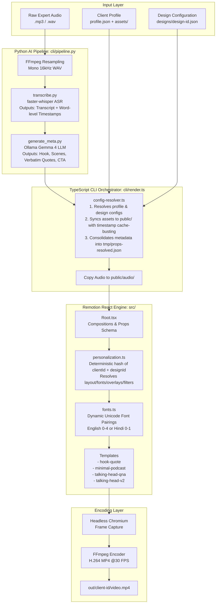

# ReelForge Developer & Architecture Guide

ReelForge is an automated video production factory that takes raw expert audio (30s – 120s) and outputs design-personalized, localized, and platform-optimized vertical videos (9:16) for social media (Instagram Reels, YouTube Shorts, TikTok).

This guide consolidates the entire ReelForge codebase architecture, configuration layer, rendering logic, templates, and personalization engine into a single reference document.

---

## 1. High-Level System Architecture

ReelForge divides work between a **local Python AI pipeline** (Whisper transcription & Ollama LLM metadata generation) and a **React-based Remotion rendering engine** (Chromium frame generation & FFmpeg encoding).



---

## 2. Codebase Directory Map & File Index

*   [`cli/`](file:///Users/ankur/dev/docx/ppt/reel-forge/cli) — Command-line tools and Python AI orchestration scripts.
    *   [`render.ts`](file:///Users/ankur/dev/docx/ppt/reel-forge/cli/render.ts) — Main orchestrator. Runs AI pipeline, resolves client configs, writes props, and executes Remotion.
    *   [`pipeline.py`](file:///Users/ankur/dev/docx/ppt/reel-forge/cli/pipeline.py) — Links ASR and LLM output together into a structured payload.
    *   [`transcribe.py`](file:///Users/ankur/dev/docx/ppt/reel-forge/cli/transcribe.py) — Audio resampler and Whisper ASR runner. Outputs word-level timestamps.
    *   [`generate_meta.py`](file:///Users/ankur/dev/docx/ppt/reel-forge/cli/generate_meta.py) — Ollama generator for hook text, scene breaks, and key quotes.
    *   [`generate_sfx.py`](file:///Users/ankur/dev/docx/ppt/reel-forge/cli/generate_sfx.py) — Programmatic sound effect synthesiser (whoosh, pop, ding, etc.).
*   [`clients/`](file:///Users/ankur/dev/docx/ppt/reel-forge/clients) — Customer directory containing avatars, logos, backgrounds, and styling preferences.
    *   `<client-id>/profile.json` — Expert metadata, image lists, and role-tagged image sets.
    *   `<client-id>/designs/` — Folder containing customizable design variants (e.g. `classic-reels.json`).
*   [`src/`](file:///Users/ankur/dev/docx/ppt/reel-forge/src) — React & Remotion project files.
    *   [`Root.tsx`](file:///Users/ankur/dev/docx/ppt/reel-forge/src/Root.tsx) — Main Remotion entrypoint declaring video composition specifications, durations, and prop schemas.
    *   [`global-schema.ts`](file:///Users/ankur/dev/docx/ppt/reel-forge/src/global-schema.ts) — Zod prop validations enforcing structure on all pipeline outputs.
    *   [`lib/config-resolver.ts`](file:///Users/ankur/dev/docx/ppt/reel-forge/src/lib/config-resolver.ts) — Resolves client configurations and performs asset copy cache-busting.
    *   [`lib/personalization.ts`](file:///Users/ankur/dev/docx/ppt/reel-forge/src/lib/personalization.ts) — Deterministic visual customizer that prevents video homogeneity across client designs.
    *   [`templates/`](file:///Users/ankur/dev/docx/ppt/reel-forge/src/templates) — React compositions defining individual layout designs.
        *   [`_shared/fonts.ts`](file:///Users/ankur/dev/docx/ppt/reel-forge/src/templates/_shared/fonts.ts) — Pairings loader for English and Hindi typography.
        *   [`_shared/themes.ts`](file:///Users/ankur/dev/docx/ppt/reel-forge/src/templates/_shared/themes.ts) — Configured color templates.
        *   [`talking-head-qna/index.tsx`](file:///Users/ankur/dev/docx/ppt/reel-forge/src/templates/talking-head-qna/index.tsx) — Advanced Q&A Remotion composition.
        *   [`talking-head-qna/HookGallery.tsx`](file:///Users/ankur/dev/docx/ppt/reel-forge/src/templates/talking-head-qna/HookGallery.tsx) — Library of 16 high-impact viral video hook animations.
*   [`docs/`](file:///Users/ankur/dev/docx/ppt/reel-forge/docs) — Technical specs, safe zones, and high-level designs.
*   [`out/`](file:///Users/ankur/dev/docx/ppt/reel-forge/out) — Rendered vertical MP4 reels grouped by `<client-id>`.

---

## 3. Client Onboarding and Design Configurations

To support hundreds of templates and configurations without duplicating logic, ReelForge separates **Client Identity** from **Branding Profiles**.

### 1. Identity Specification (`profile.json`)
Placed under `clients/<client-id>/profile.json`. Defines the doctor, their specialization, assets, and role-tagged images:
```json
{
  "name": "Dr. Priya Sharma",
  "specialty": "Dermatologist",
  "domain": "Skincare",
  "avatar": "avatar.png",
  "logo": "logo.png",
  "imageSet": [
    { "file": "avatar.png", "role": "hook", "alt": "Doctor portrait" },
    { "file": "clinic-outside.png", "role": "scene", "alt": "Clinic exterior" },
    { "file": "clinic-inside.png", "role": "scene", "alt": "Consultation room" },
    { "file": "avatar.png", "role": "cta", "alt": "Doctor photo" }
  ],
  "minPhotoRequirements": {
    "portrait": 1,
    "clinic": 1,
    "consultation": 1
  }
}
```

### 2. Design Profile (`designs/<design-id>.json`)
Placed under `clients/<client-id>/designs/<design-id>.json`. Maps the layout to a template, configures CTA info, locks specific hook styles, and configures fallback background treatments:
```json
{
  "template": "talking-head-qna",
  "defaultLanguage": "en",
  "ctaText": "Get glowing skin. Book a clinical consultation today.",
  "ctaType": "appointment",
  "ctaTitle": "Book Skincare Appointment",
  "ctaLink": "drpriyasharma.com/book",
  "ctaHandle": "@drpriyaskincare",
  "hookStyle": "zoom-face",
  "theme": {
    "accentColor": "#E07B54",
    "textColor": "#FFFFFF",
    "textSecondaryColor": "#F0D9CC",
    "bgType": "hero-portrait",
    "bgSolid": "#1A0F0A",
    "overlayStyle": "scrim-bottom"
  }
}
```

---

## 4. The AI Transcription & Metadata Pipeline

The orchestrator (`cli/render.ts`) triggers the AI Pipeline, which does the following:

1.  **Resampling**: Python resamples the input audio file to `16kHz mono WAV` using a temporary FFmpeg subprocess to maximize ASR accuracy.
2.  **Whisper ASR (`cli/transcribe.py`)**: Runs local `faster-whisper` (falling back to standard `openai-whisper` on CPU if not installed) using the `small` model size to output:
    *   Complete transcript text.
    *   Total audio duration in seconds.
    *   **Word-level timestamps** containing `word`, `start` (seconds), and `end` (seconds) bounds.
3.  **Local LLM Metadata Parser (`cli/generate_meta.py`)**: Calls a local Ollama instance (defaulting to the `gemma4:e4b` model). It asks the model to output a structured JSON response based on the transcript containing:
    *   `hookText`: An attention-grabbing hook (5–10 words) following viral templates (Myth-Bust, Shocking Stat, Urgency, Question, Bold Claim, Revelation).
    *   `hookStyle`: Recommended hook animation (e.g. `typewriter-terminal`, `redacted`, `ehr-file`) based on the content tone.
    *   `scenes`: 3–5 segments splitting the video time. Each scene contains a `keyQuote` representing the most surprising, emotional, or actionable sentence from that segment.
    *   `ctaText`: A call-to-action tailored to the transcript topic.
    *   `language`: Localized translations (Visual texts generated directly in English, Hindi Devanagari, or Hinglish depending on target settings).

---

## 5. Client Asset Cache-Busting & Config Resolver

Because Chrome/Puppeteer engines cache local static paths aggressively during Remotion renderings, `src/lib/config-resolver.ts` performs cache-busting during assembly:
1.  Copies raw files inside `clients/<client-id>/assets/` to `public/clients/<client-id>/`.
2.  Appends a runtime-specific timestamp and index (e.g., `avatar.png` -> `171754600-0-avatar.png`).
3.  Outputs relative URLs (`clients/<client-id>/171754600-0-avatar.png`) to Remotion, forcing Chrome to reload resources.
4.  Consolidates resolved profiles, designs, and AI outputs into `tmp/props-resolved.json`, which is passed to the Remotion CLI.

---

## 6. Deterministic Personalization Engine

To prevent different doctors using the same templates from looking identical, the personalization engine (`src/lib/personalization.ts`) applies deterministic styling.

### Hash Algorithm
It takes the client's ID and design ID, runs a **djb2 hashing function**, and applies different numerical salt seeds to generate deterministic styles:

$$\text{seed} = \text{djb2Hash}(\text{clientId} + \text{"::"} + \text{designId})$$

Using different salt offsets, it maps choices deterministically across six branding dimensions:

| Personalization Dimension | Salt Seed | Options Count | Resolved Elements |
|---|---|---|---|
| **Font Pairing** | Salt 0 | 5 pairings | English (0-4) or Hindi (0-1) Google Fonts |
| **Layout Variant** | Salt 1 | 4 variants | `quote-bottom-center`, `quote-bottom-left`, `quote-top`, `quote-split` |
| **Overlay Style** | Salt 2 | 3 styles | `scrim-bottom` (legibility gradient), `scrim-full`, `vignette` |
| **Decoration Style** | Salt 3 | 4 styles | `accent-bar` (thick left border), `accent-line` (top line), `quote-marks`, `numbered` |
| **Image Treatment** | Salt 4 | 3 filters | `full-color`, `duotone-warm` (terracotta sepia), `duotone-cool` (clinical blue) |
| **Quote Position** | Salt 5 | 3 positions | `bottom`, `center`, `top` card placements |

This creates $5 \times 4 \times 3 \times 4 \times 3 \times 3 = 2,160$ unique combinations. Same doctor design always gets a consistent brand identity, while different doctors get distinct styles automatically. **Design configurations can override any of these dimensions explicitly.**

---

## 7. Remotion React Compositions & Layout Specs

All compositions are defined in [`src/Root.tsx`](file:///Users/ankur/dev/docx/ppt/reel-forge/src/Root.tsx) at **1080 × 1920** (9:16 portrait) at **30 FPS**.

### Safe Zone Constraints
To avoid conflicts with social media platform UI overlays (hearts, comments, channel headers):
*   **Safe Zone Box**: Centered `900px × 1400px` boundary.
*   **Vertical Buffers**: Top and bottom bounds must keep a minimum `260px` margin clear of text overlays.
*   **Right Buffer**: Keep a `120px` right-hand margin free of captions/graphics to prevent platform interaction buttons (Like/Share/Audio Disc) from blocking readable content.

### Dynamic Fonts Loader (`src/templates/_shared/fonts.ts`)
Fonts are loaded dynamically via `@remotion/google-fonts` to avoid fallback issues:
*   **English font pairings**:
    1.  *Classic Serif*: `Playfair Display` + `Inter`
    2.  *Modern Sans*: `Montserrat` + `Lora`
    3.  *Strong Display*: `Oswald` + `Source Sans 3`
    4.  *Warm Round*: `Poppins` + `Merriweather`
    5.  *Tech Clean*: `Inter` + `Playfair Display`
*   **Hindi font pairings**:
    1.  *Hindi Classic*: `Rozha One` + `Mukta`
    2.  *Hindi Modern*: `Mukta` + `Poppins`

### Color Themes (`src/templates/_shared/themes.ts`)
Bundled themes supply primary layouts:
*   `warm-minimal`: Terracotta `#C86E4B` accent on soft warm cream.
*   `neon-tech`: Neon Teal `#00F5D4` accent with glowing particles.
*   `classic-professional`: Gold `#E2B13C` accent on dark slate blue.
*   `vibrant-energy`: Electric Magenta `#FF2A7A` accent over animated abstract waves.
*   `hero-warm` / `hero-clinical` / `hero-gold`: Portrait layouts tailored to specific clinical segments.

### Programmatic Sound Effects
The orchestrator verifies that SFX audio files exist, generating them via [`cli/generate_sfx.py`](file:///Users/ankur/dev/docx/ppt/reel-forge/cli/generate_sfx.py) if missing:
*   `boom.wav` (intro hook drops)
*   `whoosh.wav` (typewriter slide/visual transition sweeps)
*   `pop.wav` (caption text word entries)
*   `ding.wav` (key quote dings / outro reveal)
*   `click.wav` (typewriter keyboard mechanical sounds)

---

## 8. Templates Reference Specification

### 1. `hook-quote`
A text-focused template that alternates high-impact headlines and scene-level key quotes.
*   **Hook Intro (0s – 3s)**: Typewriter-animated scrolling hook title. Background displays the first client asset (e.g., `clinic-outside.png`).
*   **Main Speech**: Displays the expert branding badge (avatar, name, and specialty) at the bottom. The background slideshow cycles through client images while key quote overlays update.
*   **Outro CTA (Final 4s)**: An outro screen featuring clinic details, logo, and a volume fade-out.

### 2. `minimal-podcast`
An audio-visualizer-centric template.
*   **Layout**: Displays the doctor's avatar inside a rotating, audio-reactive wave visualizer ring at the center of the viewport.
*   **Audio Waveforms**: Employs a moving-average filter across 3 frames to smooth visual visualizer jitter. Outer glows scale in brightness based on voice amplitude.
*   **Background Cycling**: Background image shifts between different clinic environments to keep the visual design dynamic.

### 3. `talking-head-qna` (High-Engagement Viral Master)
A premium talking-head format designed to maximize initial hook retention.
*   **Smart Q&A Sync Mode**: Automatically inspects the first 15 words of the transcription.
    *   *Mode A (Spoken Question)*: If a question mark is detected, the audio starts playing at frame 0, highlighting the patient's spoken words in real time.
    *   *Mode B (Typewriter Hook)*: If no spoken question is found, the audio is delayed to frame 90 (3s). The first 90 frames display a typewriter animation of the hook text, synchronized with mechanical keyboard typing SFX.
*   **PIP Corner Transition**: The question is formatted as a glassmorphic Q&A card in the center. At frame 70-90, the card scales down ($1.0 \to 0.55$) and slides into the top-left corner ($X: 0 \to -220px, Y: 0 \to -420px$) using spring physics (`damping: 15, stiffness: 100`) as the doctor answers.
*   **Auto-Zoom Cuts (Pattern Interrupts)**: To reset viewer focus, the background doctor portrait is rescaled and repositioned every 75 frames (2.5 seconds) using a spring cut ($1.05 \to 1.14 \to 1.0 \to 1.10$). Every cut triggers a 5-frame white flash visual transition and a swoosh SFX.
*   **Karaoke Captions**: Words are split into lines. Active words transition from white to the theme's accent color based on Whisper timestamps. A subtle popping sound triggers on line changes.
*   **EndingBlock CTA**: Smoothly fades out the speech audio over the final 4 seconds (120 frames) while rendering the custom clinic outro.

---

## 9. Developer Onboarding Cheat Sheet

### Onboarding a New Doctor
1.  Create `clients/<client-id>/` directory.
2.  Add a `profile.json` detailing the expert's name, specialty, domain, and asset filenames.
3.  Create `clients/<client-id>/assets/` and add `avatar.png`, `logo.png`, and background images. Make sure to define their targets inside the `imageSet` array.
4.  Create `clients/<client-id>/designs/classic-reels.json` to configure the default template, colors, and CTA details.

### Rendering a New Reel for a Client
Run the CLI orchestrator targeting the client, their design profile, and the raw audio:
```bash
npx tsx cli/render.ts \
  --client dr-priya-sharma \
  --design classic-reels \
  --audio cli/sample-inputs/question-1.mp3
```

### Launching the Remotion Studio Preview Player
To preview frames, inspect properties, or verify hook animations in the browser:
```bash
npx tsx cli/render.ts \
  --client dr-priya-sharma \
  --design classic-reels \
  --audio cli/sample-inputs/question-1.mp3 \
  --preview
```
Open `http://localhost:3000` in the browser to interact.

---

## 10. CLI Arguments Reference

| Argument Flag | Input Parameter | Required | Description |
|---|---|---|---|
| `--client` | `string` (folder name) | Yes (or overrides) | Client identifier under `clients/` folder. |
| `--design` | `string` (JSON filename) | No | Target configuration inside `designs/` (default: `classic-reels`). |
| `--audio` | `string` (file path) | Yes (or `--props`) | Raw expert voice recording (`.mp3` or `.wav`). |
| `--out` | `string` (file path) | No | Override destination for the rendered vertical MP4 video. |
| `--lang` | `string` (`en` / `hi` / `hinglish`) | No | Override language settings for fonts and transcriptions. |
| `--asr-lang` | `string` (ISO language code) | No | Lock Whisper to a specific speech language (default: auto-detect). |
| `--bg-video` | `string` (public path) | No | Custom looping video backdrop. |
| `--accent-color`| `string` (hex code) | No | Force manual override of the theme's branding color. |
| `--model` | `string` (Ollama tag) | No | Local Ollama model tag to generate metadata (default: `gemma4:e4b`). |
| `--whisper-model`| `string` (`tiny` / `base` / `small`) | No | Local Whisper ASR size parameter (default: `small`). |
| `--skip-ai` | *None* | No | Skips transcription/LLM parsing; reuses the cached props JSON. |
| `--props` | `string` (JSON path) | No | Skips AI pipeline completely, rendering using custom properties. |
| `--preview` | *None* | No | Opens Remotion Studio player server instead of encoding. |
| `--force` | *None* | No | Bypasses the cache entirely, running a fresh transcription/LLM cycle. |
| `--quick` | *None* | No | Runs ASR/LLM only if cache doesn't exist, otherwise reuses cached data. |
