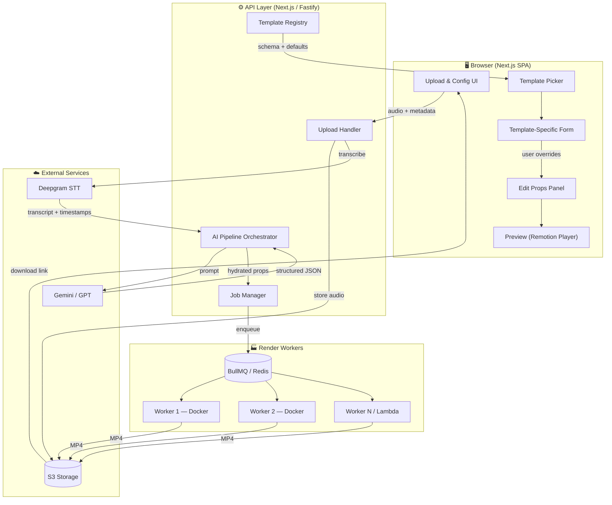
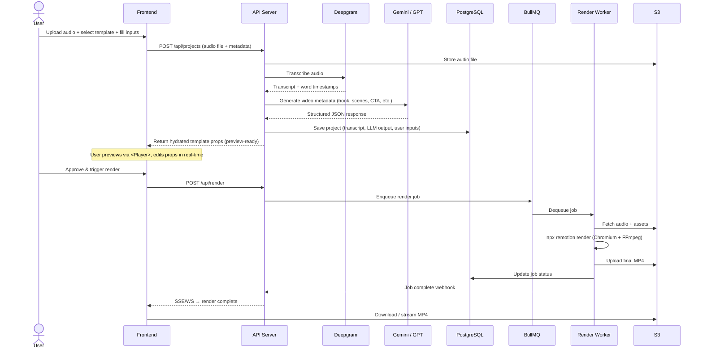
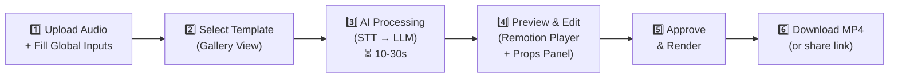
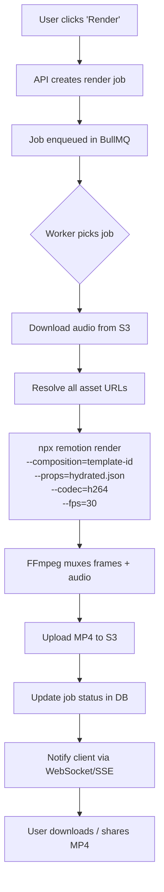

# ReelForge — Video Factory HLD

> **Goal**: Build an automated Video Factory ("ReelForge") that takes expert audio (30-120 s) + metadata and produces fully rendered, platform-optimised social-media reels (IG / YT Shorts / TikTok) with near-zero human effort after initial setup.

---

## 1. Refined Requirements

### 1.1 Core Inputs (Global — every render)

| Input | Type | Constraints |
|---|---|---|
| **Audio file** | `.mp3` / `.wav` / `.m4a` | 30 – 120 seconds |
| **Domain / Topic** | `string` | e.g. "Dermatology", "Astrology" |
| **Expert specialty** | `string` | e.g. "Cosmetic Dermatologist", "Vedic Astrologer" |
| **Expert name** | `string` | Display name |
| **Expert avatar** | `image (optional)` | Headshot / logo |
| **Target platform(s)** | `enum[]` | `instagram` · `youtube` · `tiktok` |
| **Language** | `string` | Default `en`, for future STT model selection |

### 1.2 Per-Template Inputs (vary by template)

Each template declares its own **additional input schema** (validated via Zod). Examples:

| Template | Extra inputs |
|---|---|
| `hook-quote` | `accentColor`, `fontFamily`, `backgroundVideoUrl` |
| `expert-card` | `clinicName`, `credentialsBadges[]`, `qrCodeUrl` |
| `listicle` | `bulletStyle` (`numbered` / `icon`), `iconPack` |
| `before-after` | `beforeImage`, `afterImage`, `transitionStyle` |

### 1.3 Outputs

| Attribute | Value |
|---|---|
| Resolution | **1080 × 1920** (9:16 portrait) |
| FPS | **30** (configurable to 60) |
| Codec | H.264 (MP4 container) |
| Bitrate | 5 000 kbps video / 128 kbps audio |
| Safe zone | Critical content within centred **900 × 1400** |

### 1.4 Success Metrics (restated)

| Metric | Target |
|---|---|
| End-to-end time (upload → MP4) | **< 5 min** |
| Human effort post-setup | **Zero** timeline tweaking |
| Daily throughput | **100+ unique renders** via queue |

---

## 2. Technology Decisions

### 2.1 Rendering Engine → **Remotion**

| Criterion | Remotion | Revideo | Motion Canvas |
|---|---|---|---|
| React ecosystem | ✅ Full React | ❌ Generator-based | ❌ Generator-based |
| DOM rendering (HTML/CSS in video) | ✅ | ❌ Canvas only | ❌ Canvas only |
| Headless server-side render | ✅ (Lambda / Docker) | ✅ | Limited |
| Template parameterisation | ✅ Native (`inputProps` + Zod) | Manual | Manual |
| Browser preview (`<Player>`) | ✅ Built-in | ❌ | GUI but not embeddable |
| Maturity / community | ★★★★★ | ★★☆ | ★★★ |
| License | Source-available¹ | MIT | MIT |

> **Decision**: **Remotion** — its React-based model means every template is just a React component with typed props. The `<Player>` component gives us instant in-browser preview. DOM-based rendering lets us use CSS animations, Google Fonts, SVGs, etc. natively.

> ¹ Remotion is free for individuals and companies with ≤ 3 people. Larger teams require a paid license (~$750/yr per dev seat for "Company" or a one-time enterprise deal). Given the scale ambitions, budget for this.

### 2.2 AI Pipeline

| Step | Service | Why |
|---|---|---|
| **Speech-to-Text** | **Deepgram Nova-3** (primary) / Whisper (fallback) | Word-level timestamps, ultra-low latency (~280 ms), excellent English accuracy. Timestamps needed for audio segmentation & scene alignment. |
| **LLM — Metadata Generation** | **Gemini 2.5 Flash** (primary) / GPT-4o (fallback) | From the transcript, generate: hook text, scene breakpoints, key quotes, CTA text, hashtags, title. Structured JSON output via function calling. |
| **TTS (optional future)** | ElevenLabs / Google Cloud TTS | For voice-over intros or translated narration — **not in MVP**. |

### 2.3 Frontend Stack

| Layer | Choice |
|---|---|
| Framework | **Next.js 15** (App Router) |
| Video preview | `@remotion/player` |
| State management | Zustand (lightweight, good for form-heavy UIs) |
| Forms / Validation | React Hook Form + **Zod** (same schemas as Remotion props) |
| Styling | Vanilla CSS + CSS Modules |
| File uploads | `react-dropzone` → presigned S3 PUT |

### 2.4 Backend / API

| Layer | Choice |
|---|---|
| API | **Next.js API Routes** (for MVP) or separate **Fastify** service |
| Queue | **BullMQ** (Redis-backed) for render job orchestration |
| Storage | **S3** (audio uploads, rendered videos, assets) |
| Database | **PostgreSQL** (Drizzle ORM) — jobs, templates registry, render history |

### 2.5 Rendering Infrastructure

Two modes, selectable per deployment:

```
┌─────────────────────────────────────────────────────┐
│  Option A — Docker Self-Hosted (recommended start)  │
├─────────────────────────────────────────────────────┤
│  BullMQ Worker → Chromium + FFmpeg in Docker        │
│  `npx remotion render` per job                      │
│  Scales via Docker Compose replicas / K8s           │
│  Cost-effective, full control                       │
└─────────────────────────────────────────────────────┘

┌─────────────────────────────────────────────────────┐
│  Option B — Remotion Lambda (scale burst)           │
├─────────────────────────────────────────────────────┤
│  renderMediaOnLambda() from API                     │
│  Parallel chunk rendering across Lambda functions   │
│  ~30s render for 60s video                          │
│  Higher cost, zero infra management                 │
└─────────────────────────────────────────────────────┘
```

> **Recommendation**: Start with **Option A** for development and moderate load. Add **Option B** as a burst-scaling lane when daily volume exceeds ~200 renders or latency SLA tightens.

---

## 3. System Architecture



---

## 4. Data Flow — End to End



---

## 5. Template System Design

### 5.1 Template Contract

Every template is a self-contained module:

```
templates/
├── hook-quote/
│   ├── index.tsx            # Main Remotion <Composition> component
│   ├── schema.ts            # Zod schema for template-specific props
│   ├── defaults.ts          # Default values for all props
│   ├── thumbnail.png        # Gallery preview image
│   ├── meta.json            # { name, description, tags, author }
│   └── assets/              # Template-specific fonts, images, etc.
├── expert-card/
│   └── ...
├── listicle/
│   └── ...
└── _shared/                 # Shared components (progress bars, waveforms, etc.)
    ├── AudioWaveform.tsx
    ├── SafeZone.tsx
    └── BrandWatermark.tsx
```

### 5.2 Schema Architecture (shared between FE form + Remotion render)

```typescript
// templates/hook-quote/schema.ts
import { z } from 'zod';

// ── Global schema (every template gets these) ──────────────
export const globalInputSchema = z.object({
  audioUrl:        z.string().url(),
  transcript:      z.string(),
  expertName:      z.string(),
  expertSpecialty: z.string(),
  domain:          z.string(),
  expertAvatar:    z.string().url().optional(),
  hookText:        z.string(),              // LLM-generated
  ctaText:         z.string().optional(),   // LLM-generated
  scenes:          z.array(z.object({       // LLM-generated
    startSec: z.number(),
    endSec:   z.number(),
    label:    z.string(),
    keyQuote: z.string().optional(),
  })),
  durationInFrames: z.number(),
  fps:              z.number().default(30),
});

// ── Template-specific schema ───────────────────────────────
export const templateInputSchema = z.object({
  accentColor:      z.string().default('#FF6B35'),
  fontFamily:       z.enum(['Inter', 'Poppins', 'Playfair Display']).default('Inter'),
  backgroundStyle:  z.enum(['gradient', 'particles', 'solid']).default('gradient'),
  showWaveform:     z.boolean().default(true),
});

// ── Merged (what the Remotion component actually receives) ─
export const compositionSchema = globalInputSchema.merge(templateInputSchema);
export type CompositionProps = z.infer<typeof compositionSchema>;
```

### 5.3 Template Registry

```typescript
// lib/templateRegistry.ts
interface TemplateDefinition {
  id: string;
  name: string;
  description: string;
  tags: string[];           // ["medical", "professional", "minimal"]
  thumbnail: string;        // URL to preview image
  schema: z.ZodObject<any>; // Template-specific Zod schema
  defaults: Record<string, any>;
  component: React.LazyExoticComponent<React.FC<any>>;
}

// Auto-discovered from templates/**/meta.json at build time
export const templateRegistry: Map<string, TemplateDefinition>;
```

### 5.4 Starter Template Ideas

| Template ID | Description | Visual Style |
|---|---|---|
| `hook-quote` | Bold hook text → expert audio with waveform → key quote highlight → CTA | Gradient bg, large serif hook, animated waveform |
| `expert-card` | Expert intro card → audio plays over abstract bg → credentials slide → CTA | Clean, card-based, professional |
| `listicle` | Hook → numbered tips extracted from transcript → recap → CTA | Bright, numbered cards, slide transitions |
| `before-after` | Split-screen reveal → expert narration → result showcase | Dramatic wipe transitions |
| `minimal-podcast` | Centered waveform + speaker name, rotating key quotes as subtitles | Dark bg, neon accent, audiophile aesthetic |
| `news-ticker` | Breaking-news style lower third, expert audio, scrolling context | Bold reds, urgent typography |

---

## 6. AI Pipeline Detail

### 6.1 LLM Prompt Strategy

The API sends the transcript + metadata to the LLM with a structured output schema:

```
SYSTEM: You are a social media content strategist. Given an expert audio
transcript, generate metadata for a short-form video reel.

INPUT:
- Transcript: {transcript}
- Domain: {domain}
- Expert: {expertName} ({expertSpecialty})
- Audio duration: {durationSec}s

OUTPUT (JSON):
{
  "hookText": "A 5-10 word attention-grabbing hook for the first 3 seconds",
  "scenes": [
    {
      "startSec": 0, "endSec": 15,
      "label": "intro",
      "keyQuote": "exact quote from transcript if applicable"
    },
    ...
  ],
  "ctaText": "Follow for more {domain} tips!",
  "hashtags": ["#health", "#dermatology", ...],
  "title": "SEO-optimized title for the reel",
  "summary": "1-sentence description"
}
```

### 6.2 Caption Philosophy

> **No word-by-word synced captions in the video itself.**

Rationale (per your philosophy):
- Instagram, YouTube, and TikTok all auto-generate highly accurate captions natively.
- Rendering synced captions is computationally expensive and fragile.
- Instead, we render **static high-impact typography** (hook text, key quotes) at scene boundaries — driven by the LLM's scene breakdown, not by word timestamps.
- Word-level timestamps from STT are still useful for **scene segmentation** (knowing where natural pauses/topic shifts occur).

---

## 7. Frontend UX Flow



### 7.1 Preview & Edit Screen (Step 4)

The heart of the system. Two-panel layout:

```
┌─────────────────────────────────────────────────────────┐
│                    ReelForge Editor                      │
├────────────────────────┬────────────────────────────────┤
│                        │                                │
│   ┌──────────────┐     │   Props Panel                  │
│   │              │     │   ┌──────────────────────────┐ │
│   │  Remotion    │     │   │ Hook Text: [editable]    │ │
│   │  <Player>    │     │   │ Accent Color: [picker]   │ │
│   │              │     │   │ Font: [dropdown]         │ │
│   │  9:16        │     │   │ Background: [select]     │ │
│   │  Preview     │     │   │ Show Waveform: [toggle]  │ │
│   │              │     │   │ CTA Text: [editable]     │ │
│   │              │     │   │ Scenes: [reorderable]    │ │
│   │              │     │   └──────────────────────────┘ │
│   └──────────────┘     │                                │
│   [▶ Play] [⏸ Pause]  │   [💾 Save Draft]              │
│   ━━━━━●━━━━━━━━━━━    │   [🚀 Render Final Video]      │
│   0:00 / 0:45          │                                │
├────────────────────────┴────────────────────────────────┤
│  Scene Timeline: [Intro 0-8s] [Main 8-30s] [CTA 30-45s]│
└─────────────────────────────────────────────────────────┘
```

- **Left**: Live `<Player>` preview — updates in real-time as user tweaks props.
- **Right**: Auto-generated form from the template's Zod schema. Every field change instantly reflects in the Player.
- **Bottom**: Simplified scene timeline (not a frame-level NLE — just clickable scene segments for navigation).

---

## 8. Rendering Pipeline



### 8.1 Render Performance Budget

For a **60-second video @ 30 FPS = 1800 frames**:

| Phase | Est. Time | Notes |
|---|---|---|
| Audio download from S3 | ~1 s | |
| Asset resolution | ~1 s | Fonts, images, etc. |
| Frame rendering (Docker, 4 vCPU) | ~90–120 s | ~15–20 frames/s typical for Remotion |
| FFmpeg encoding | ~10–15 s | H.264, single-pass |
| Upload to S3 | ~3–5 s | ~20 MB file |
| **Total** | **~2–2.5 min** | Well within 5-min target |

With Remotion Lambda (parallel chunks): **~25–40 s total**.

---

## 9. Project Structure

```
reelforge/
├── apps/
│   └── web/                          # Next.js 15 app
│       ├── app/
│       │   ├── page.tsx              # Landing / dashboard
│       │   ├── create/
│       │   │   ├── page.tsx          # Upload + template selection
│       │   │   └── [projectId]/
│       │   │       └── page.tsx      # Preview & edit
│       │   └── api/
│       │       ├── projects/         # CRUD for projects
│       │       ├── render/           # Trigger renders
│       │       ├── templates/        # List available templates
│       │       └── webhooks/         # Render completion callbacks
│       ├── components/
│       │   ├── TemplateGallery.tsx
│       │   ├── PropsEditor.tsx       # Dynamic form from Zod schema
│       │   ├── VideoPreview.tsx      # Remotion <Player> wrapper
│       │   └── RenderStatus.tsx
│       └── lib/
│           ├── ai/
│           │   ├── transcribe.ts     # Deepgram client
│           │   └── generateMeta.ts   # LLM prompt + parsing
│           ├── templates/
│           │   └── registry.ts       # Template discovery + registry
│           └── storage/
│               └── s3.ts             # Presigned URLs, upload/download
│
├── packages/
│   └── templates/                    # Remotion template library
│       ├── src/
│       │   ├── global-schema.ts      # Shared Zod schema
│       │   ├── hook-quote/
│       │   │   ├── index.tsx
│       │   │   ├── schema.ts
│       │   │   ├── defaults.ts
│       │   │   └── assets/
│       │   ├── expert-card/
│       │   ├── listicle/
│       │   ├── minimal-podcast/
│       │   └── _shared/
│       │       ├── SafeZone.tsx
│       │       ├── AudioWaveform.tsx
│       │       └── BrandWatermark.tsx
│       ├── remotion.config.ts
│       └── package.json
│
├── services/
│   └── render-worker/                # BullMQ worker process
│       ├── worker.ts
│       ├── Dockerfile
│       └── docker-compose.yml
│
├── infra/                            # IaC (Terraform / Pulumi)
│   ├── s3.tf
│   ├── redis.tf
│   └── lambda.tf                     # Optional Remotion Lambda
│
└── package.json                      # Monorepo root (pnpm workspaces)
```

---

## 10. Phased Roadmap

### Phase 1 — Foundation (Weeks 1–3)

- [ ] Monorepo setup (pnpm workspaces, Next.js, Remotion)
- [ ] Global input schema + Zod validation
- [ ] Deepgram STT integration
- [ ] LLM metadata generation (Gemini Flash)
- [ ] **1 template** (`hook-quote`) — fully functional
- [ ] `<Player>` preview with real-time prop editing
- [ ] Docker-based local render pipeline
- [ ] S3 upload/download flow

### Phase 2 — Polish & Templates (Weeks 4–5)

- [ ] Template registry + gallery UI
- [ ] 3 more templates (`expert-card`, `listicle`, `minimal-podcast`)
- [ ] BullMQ job queue with status tracking
- [ ] WebSocket/SSE render progress notifications
- [ ] Scene timeline navigation in editor
- [ ] Render history dashboard

### Phase 3 — Scale & Production (Weeks 6–8)

- [ ] Remotion Lambda integration (burst rendering)
- [ ] Multi-platform output variants (bitrate/format per platform)
- [ ] Batch rendering (upload CSV + audio folder → queue 100+ jobs)
- [ ] Template creation SDK + documentation (for growing template library)
- [ ] Auth + multi-tenant support
- [ ] Monitoring, error tracking, cost dashboards

---

## User Review Required

> [!IMPORTANT]
> **Remotion Licensing**: Remotion requires a paid license for companies with > 3 employees. Please confirm team size and whether the licensing cost (~$750/yr per seat) is acceptable, or if we should also evaluate **Revideo** (MIT, less mature) as a fallback.

> [!IMPORTANT]
> **Hosting / Cloud**: The architecture assumes AWS (S3, Lambda, Redis). If you have a different cloud preference (GCP, self-hosted, etc.), this affects the storage, queue, and rendering infrastructure choices.

---

## Open Questions

> [!IMPORTANT]
> **1. LLM Provider Priority**: I've defaulted to **Gemini 2.5 Flash** for speed + cost, with GPT-4o as fallback. Do you have a preference or existing API keys/billing for a specific provider (OpenAI, Anthropic, Google)?

> [!IMPORTANT]  
> **2. STT Provider**: **Deepgram** is recommended for speed; **AssemblyAI** offers richer "audio intelligence" (sentiment, topics) that could enhance template selection. Do you need those extra features, or is speed the priority?

> [!WARNING]
> **3. Stock Media / Background Assets**: Templates like `hook-quote` need background visuals (gradients work, but stock video/images are more engaging). Options:
> - **A.** Bundle curated static backgrounds per template (simplest)
> - **B.** Integrate a stock media API (Pexels/Unsplash — free) to auto-select based on domain
> - **C.** AI-generated backgrounds (Stable Diffusion / DALL-E) per render
> 
> Which approach, or a combination?

> [!NOTE]
> **4. Expert Avatar**: Is the expert's photo/avatar always available? If not, should we auto-generate a stylised avatar/monogram from the expert's name?

> [!NOTE]
> **5. Multi-language**: You mentioned `language` as an input. For MVP, should we support only English STT, or do we need Hindi / regional language support from day one? This affects STT model choice.

> [!NOTE]
> **6. Separate Repo vs This Repo**: This workspace is currently an open-slide presentation project. Should ReelForge live in a **new separate repository**, or as a subdirectory here? (Strongly recommend separate repo given this is a full product.)

---

## Verification Plan

### Automated Tests
- Unit tests for Zod schema validation (all templates)
- Integration test: audio upload → STT → LLM → props generation (mocked external APIs)
- Remotion `npx remotion still` snapshot tests for each template
- E2E render test: submit job → verify MP4 output exists + correct duration

### Manual Verification
- Preview every template in `<Player>` with sample data
- Render each template to MP4 and manually verify on actual Instagram / YouTube upload
- Load test: queue 50 concurrent render jobs, measure throughput and error rate
