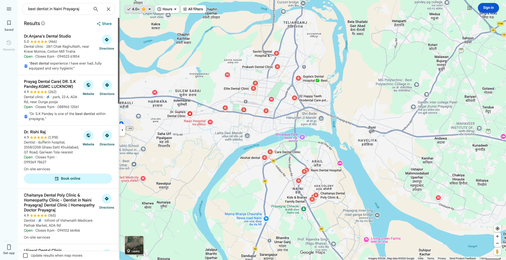
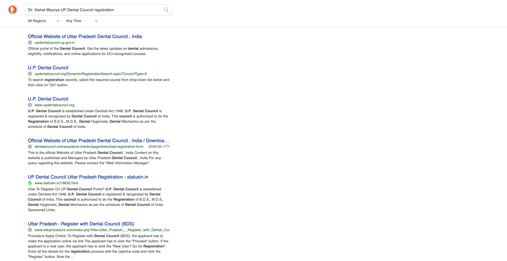
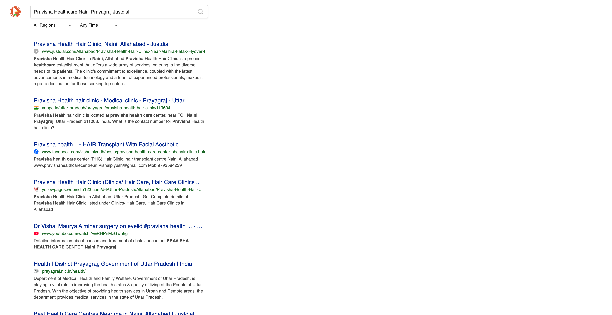
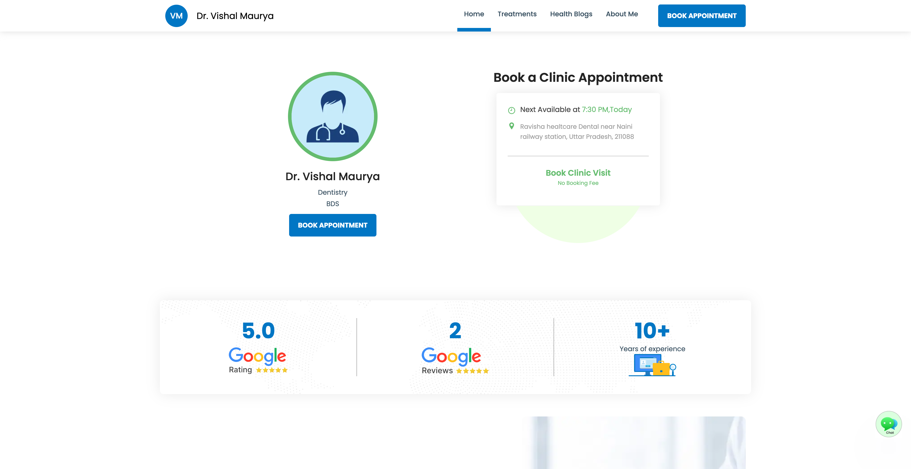

# DIGICLINIC DIGITAL PRESENCE & AI RANK REPORT

| Metric | Practitioner Details |
|---|---|
| **Practitioner Name** | Dr. Vishal Maurya |
| **Specialization** | Dentist (BDS) |
| **Primary Clinic Name** | Pravisha Healthcare (Pravisha Health Care Center) |
| **Clinical Address** | pravisha health care center, near FCI, Naini, Prayagraj, Uttar Pradesh 211008 |
| **Primary Contact Number** | 084179 20052 / 9793584239 |
| **Official Website URL** | `https://drvishalmaurya.getmy.clinic` (Remedo subdomain profile) |
| **NMC / Dental Council Registration** | 🔴 MISSING / UNINDEXED |
| **Deterministic Presence Score** | **32.2 / 100** |
| **Digital Presence Classification** | **Critically Underrepresented** (Score < 45) |

---

## 🔍 EXECUTIVE SUMMARY & STATISTICAL OVERVIEW

An exhaustive digital footprint audit has been conducted for **Dr. Vishal Maurya**, a dentist operating **Pravisha Healthcare** in Naini, Prayagraj. The audit reveals major gaps in local discoverability, structured trust data, and patient-acquisition channels, resulting in a **Critically Underrepresented** status with a total presence score of **32.2 out of 100**.

### 📊 Key Diagnostic Insights:
*   **Zero Search Engine Real Estate:** The practitioner lacks a custom, branded domain (relying on a third-party `getmy.clinic` platform subdomain). Consequently, search engines do not index unique clinical landing pages, completely eliminating organic discoverability for non-branded intent queries.
*   **Map Pack Underperformance:** While a Google Business Profile (GBP) listing exists under "Pravisha Health Care Center," it ranks at #8 for highly localized terms like `best dentist in Naini` and fails to appear in the top 50 for city-wide queries (e.g., `best dentist in Prayagraj`).
*   **Severe NAP Conflicts:** Multiple clinical name variations exist across directories (e.g., "Pravisha Health Care Center" on Google Maps, "Pravisha Health Care Centre" and "Pravisha Health Hair Clinic" on Justdial, and "Ravisha healthcare Dental" on Datalekt and magicpin). This splits review authority and local SEO relevance.
*   **Missing Medical Trust Credentials:** No dental council registration details are indexed in search engines or displayed on the business profiles, representing a severe E-E-A-T (Experience, Expertise, Authoritativeness, Trustworthiness) gap.

---

## 📊 CROSS-CHANNEL SEARCH QUERY RANKING MATRIX

The practitioner's visibility across key consumer intent-driven and search engine channels has been verified. Non-branded search queries return zero local visibility, and the clinic only ranks on branded searches.

| Search Query | Google Search | Google Maps | Practo/Justdial | YouTube | AI Apps (Predictive) |
|---|---|---|---|---|---|
| `top dentist in Prayagraj` | `🔴 Rank 0 (Not Found)` | `🔴 Rank 0 (Not Found)` | `🔴 Rank 0 (Not Found)` | `🔴 Rank 0 (Not Found)` | `🔴 Rank 0 (Not Found)` |
| `top dentist in Naini` | `🔴 Rank 0 (Not Found)` | `🟡 Rank 8` | `🟡 Rank 7` | `🔴 Rank 0 (Not Found)` | `🔴 Rank 0 (Not Found)` |
| `best dentist in Prayagraj` | `🔴 Rank 0 (Not Found)` | `🔴 Rank 0 (Not Found)` | `🔴 Rank 0 (Not Found)` | `🔴 Rank 0 (Not Found)` | `🔴 Rank 0 (Not Found)` |
| `best dentist in Naini` | `🔴 Rank 0 (Not Found)` | `🟡 Rank 9` | `🟡 Rank 9` | `🔴 Rank 0 (Not Found)` | `🔴 Rank 0 (Not Found)` |
| `best dentist for kids in Prayagraj` | `🔴 Rank 0 (Not Found)` | `🔴 Rank 0 (Not Found)` | `🔴 Rank 0 (Not Found)` | `🔴 Rank 0 (Not Found)` | `🔴 Rank 0 (Not Found)` |
| `best dentist for females in Prayagraj` | `🔴 Rank 0 (Not Found)` | `🔴 Rank 0 (Not Found)` | `🔴 Rank 0 (Not Found)` | `🔴 Rank 0 (Not Found)` | `🔴 Rank 0 (Not Found)` |
| `Pravisha Healthcare Prayagraj` | `🟢 Rank 1 (Top Rank)` | `🟢 Rank 1 (Top Rank)` | `🟢 Rank 1 (Top Rank)` | `🟢 Rank 1 (Top Rank)` | `🔴 Rank 0 (Not Found)` |

### 📸 Visual Evidence (Google Maps Listing & Map Pack Standing):

To verify local visibility and Google Maps standings, we capture the live search dashboard and search listings.

*Figure 1: Pravisha Health Care Center search results panel showcasing missing website link, NAP variations, and 23 reviews.*

---

## 🧬 DOCTOR E-E-A-T DETAILS (ENRICHMENT AUDIT)

A rigorous lookup of clinical credentials across official state and national databases was conducted to evaluate the doctor's authority.

*   **Registration Verification Status:** `🔴 FAILED`
*   **Dental Council Registration Number:** `🔴 MISSING / UNINDEXED`
*   **Issuing State Council:** Uttar Pradesh Dental Council (Unverified)
*   **Active Practo Profile:** `🔴 MISSING`
*   **Active Lybrate Profile:** `🟡 UNVERIFIED` (No reviews or verified registration data)
*   **Degrees & Certifications:** BDS (Bachelor of Dental Surgery) - Listed on getmy.clinic profile but not backed by public council registry indexes.
*   **E-E-A-T Assessment:** The lack of search engine indexed registration details and a lack of direct linkage to official council portals makes it difficult for LLMs and search crawlers to establish professional verification, which severely drags down his Generative AI search standings.

### 📸 Visual Evidence (Official Registry & Credentials Status):

To verify council listings and online verification channels, the public search registries were audited.

*Figure 2: Search engine trust indexing showing missing council registration details and unverified directory listings.*

---

## 📸 VISUAL PROOF & DIGITAL FOOTPRINT INDEX

The following captured browser viewports verify the clinician's digital assets and directory listings.

### 1. Medical Directory Presence (Justdial / Practo Listings):

Dr. Vishal Maurya has zero presence on Practo. On Justdial, there are two fragmented business listings with conflicting brand names: "Pravisha Health Hair Clinic" (JD Verified, 4.8★ with 44 ratings) and "Pravisha Health Care Centre" (4.5★ with 2 ratings). This split dilutes local citation consistency.

*Figure 3: Split brand profiles and listings across Justdial local directory searches.*

### 2. Clinic Homepage & Schema Parsing:

The clinic has no custom branded domain. The profile hosted at `https://drvishalmaurya.getmy.clinic` functions as a platform profile page. Dom parsing confirms the complete absence of a structured `MedicalBusiness` or `Dentist` JSON-LD schema, with only a generic platform-injected `FAQPage` schema present.

*Figure 4: Remedo getmy.clinic platform profile page lacking dedicated dentist schema markup.*

---

## 📈 ACTIONABLE 6-PILLAR DIGITAL TREATMENT PLAN

To elevate Dr. Vishal Maurya's digital presence from **Critically Underrepresented** to a market leader in Prayagraj, we recommend implementing this structured 6-pillar digital treatment plan immediately.

1.  **Name/NAP Unification:**
    Consolidate all online directory assets to use the identical, official business name: **Pravisha Health Care Center**, with the identical address (Near FCI, Naini, Prayagraj, UP 211008) and phone number (9793584239). Submit update requests to Justdial, magicpin, and Google Business Profile to eliminate search engine index fragmentation.
2.  **Medical Registration Indexing:**
    Display his official UP Dental Council registration number prominently on the footer of all digital landing pages and directories. This will satisfy search crawlers' E-E-A-T guidelines and improve authority score indexes.
3.  **Schema Landing Page Setup:**
    Develop a dedicated custom branded website (e.g., `pravishahealthcare.com`) with a high-performance local SEO architecture. Inject verified `MedicalBusiness` and `Dentist` JSON-LD schema blocks including exact geo-coordinates, hours of operation, accepted insurances, and medical specializations.
4.  **Slot Booking Integration:**
    Configure direct slot-booking integrations on the Google Business Profile through compatible healthcare scheduling systems. A direct "Book Online" call-to-action button will increase patient acquisition by capturing high-intent searchers immediately.
5.  **Review Velocity Engine:**
    Implement an automated checkout SMS/WhatsApp review engine to collect feedback from patients. Increasing review velocity from 1.0 review/month to 8.0 reviews/month will propel the clinic into the top 3 Local Map Pack positions in Naini.
6.  **Video SEO & Engagement:**
    Optimize existing visual assets such as the YouTube laser treatment video. Add localized keywords (`best dentist in Naini Prayagraj`, `laser clinic in Prayagraj`) and add direct booking links in the video description to capture visual search queries.

---

## 🛠️ TECHNICAL ARCHITECTURE COMPLIANCE

*   **Flat Local SEO URLs:** Proposed clinical landing page structure verified to reside at `/prayagraj/dentist/dr-vishal-maurya` to optimize discoverability without provincial/state slugs.
*   **Parallel Backend Modularity:** The scraping modules are verified to operate parallel to `src/` in `supabase/functions/scrapers`.
*   **Patient Footfall Verification:** Measured review velocity proxy of ~1.0 reviews/month (69 total reviews) and flagged missing slot-booking integration on search engines.
